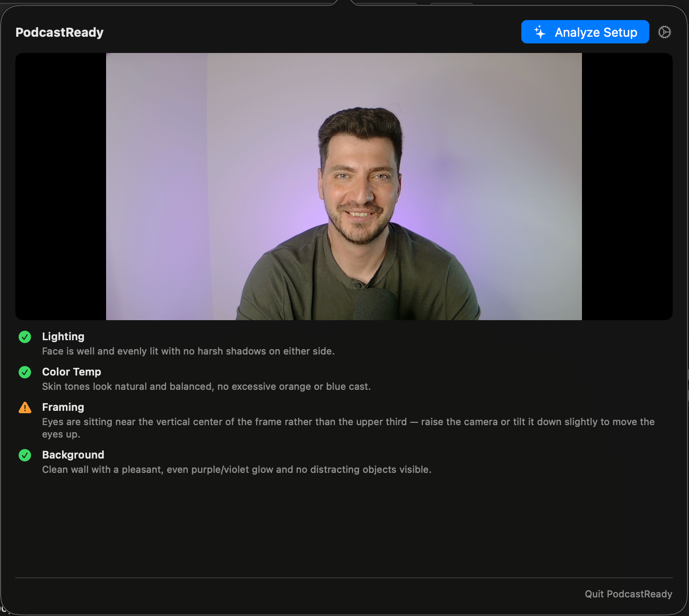

# PodcastReady

A macOS menubar app that analyzes your podcast video setup using AI before you hit record.



## Features

- Live camera preview in a menubar popover
- One-click AI analysis of your video setup via Claude Vision
- Scores lighting, color temperature, framing, and background
- Actionable suggestions for each category
- Secure API key storage in macOS Keychain
- Camera selection for multi-camera setups

## Requirements

- macOS 14.0 (Sonoma) or later
- Anthropic API key (get one at https://console.anthropic.com)

## Build & Run

```bash
swift build
.build/debug/PodcastReady
```

## Setup

1. Launch the app (appears in your menubar as a camera icon)
2. Click the icon → Settings (gear icon)
3. Enter your Anthropic API key and save
4. Click Done, then "Analyze Setup" to check your video setup
