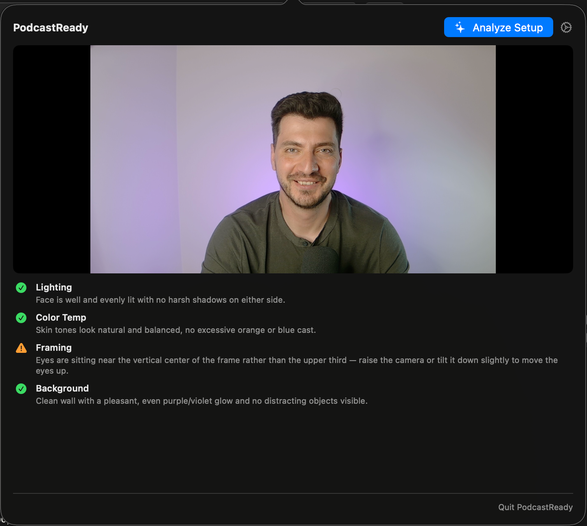

# PodcastReady

A macOS menubar app that gets your podcast video setup right before you hit record —
by **measuring** the frame, **controlling** the camera and the light, and saving the
result as a profile you can restore in one click.



## Why

Judging a webcam frame by eye does not work. A face can look "fine" while the white
t-shirt is 30 luma brighter than it; a ring light sitting on the lens axis produces a
mathematically flat face that still looks acceptable on a small preview; daylight can
make the wall behind you brighter than you are without anything looking obviously wrong.

So PodcastReady measures the frame first, in code, and only then asks a model for an
opinion — with the numbers attached.

## What it does

### Measure

Eight numbers from a captured frame, no API key and no network required. Samples are
placed from **facial landmarks** (Vision), with axes taken from the eye line, so head
tilt does not slide them around your face.

| Metric | What it catches |
|---|---|
| Forehead luma | Under- or over-exposed face |
| Key : fill | A light too close to the lens axis — a flat face |
| Face − wall | Background brighter than you |
| Shirt − face | A top that out-shines your face |
| Top R−B | Colour cast, as a share of level |
| Wall R−B | Background colour (informational when a good reference exists) |
| Clipped % / Crushed % | Blown highlights, dead shadows |
| Eye sharpness | Focus, measured on the eye band only |

### Camera control (UVC)

Full control of a UVC webcam over IOKit — exposure, gain, white balance, focus, zoom,
pan, tilt, powerline frequency, and the image sliders. No sandbox entitlement needed
for a non-sandboxed app.

Controls are rendered by kind: powerline frequency is a segmented picker filtered to
the values your camera actually reports, exposure mode is a bitmap (Manual/Auto), and
pan and tilt are two halves of one 8-byte control so writing one preserves the other.

### Light control (Elgato)

Discovers an Elgato light over Bonjour (`_elg._tcp`) and controls power, brightness and
colour temperature over its local HTTP API. On/off is in the menubar, so you never need
the vendor app. Every write reads the current state first, so a stale value cannot
clobber a change made elsewhere.

### Profiles

A profile stores the **camera settings, the light state, and the metrics the frame
measured when you saved it**. Settings alone do not give a repeatable look: the same
exposure under different light is a different picture. Applying a profile restores the
hardware and then tells you whether the *picture* came back.

`Apply on launch` restores it when the app opens.

### Magic Fix

Measure → adjust → re-measure, until the numbers it can move are in range. Two
sequential binary searches (white balance, then brightness) rather than a joint
optimiser, because they are nearly orthogonal and solving them together oscillates.

It prefers the **light** over camera exposure for brightness: a key aimed at you raises
your face roughly twice as fast as the wall behind you, where exposure lifts both
equally. It respects a brightness ceiling you set, because the loop has no way to know
what is uncomfortable to sit under.

And it reports what it **cannot** fix, rather than thrashing: key:fill is where the
light is standing, face−wall is how far the light is from the wall, shirt−face is what
you are wearing, and crushed-to-black is an unlit corner of the room. It names a
direction for the light rather than saying "move it off to one side", which is unusable
advice at 1.0:1 where there is no visible asymmetry to reason from.

### Focus on my face

Autofocus that only cares about the plane your face is in. It sweeps the focus motor and
scores each position on the **sharpness of the eye band alone**, so it cannot lock onto
a microphone closer to the lens or the detail on the wall behind you — which is exactly
what a camera's own autofocus does. `Re-focus (narrow)` searches a small window around
the current position. If the sweep comes back flat it puts focus back and says so,
rather than parking the motor somewhere arbitrary.

### Analyze

Sends the frame **and the measurements** to Claude and returns a short verdict per
category. The model is told to trust the numbers over its impression of a JPEG.

## Requirements

- macOS 14 (Sonoma) or later
- A UVC webcam for camera control (developed against a Razer Kiyo Pro Ultra)
- An Elgato light for light control (optional)
- An Anthropic API key for `Analyze` (optional; `Measure` needs nothing)

## Build & run

```bash
swift build
.build/debug/PodcastReady
```

Or build a signed `.app` and install it:

```bash
./scripts/bundle.sh              # build, sign, install to /Applications
./scripts/bundle.sh --no-copy    # build and sign only
```

`bundle.sh` signs with a Developer ID certificate if it finds one, falling back to
ad-hoc. **Prefer a real identity**: an ad-hoc signature is derived from the binary's
contents, so it changes on every build and macOS treats each build as a new app —
which means re-granting Local Network permission every time. Override with
`PODCASTREADY_SIGN_ID`.

The bundle is signed from a copy staged outside the repo. A repo under an iCloud-synced
folder carries `com.apple.FinderInfo`, and `codesign` refuses it outright.

## Permissions

- **Camera** — for the preview and for measuring.
- **Local Network** — for Bonjour discovery of the Elgato. macOS asks on first launch
  and the app cannot browse during the launch it was asked, so grant it and relaunch.

## Setup

1. Launch it — it appears in the menubar as a camera icon. Left click opens the panel,
   right click gives a short menu with the light toggle.
2. `Settings` (gear) → add an Anthropic API key if you want `Analyze`, and turn on
   `Open at login` if you want it always available.
3. Get the picture how you like it, then `Save as…` and tick `Apply on launch`.

## A note on the targets

The numbers in `MetricTarget` came from measuring a real setup, not from general advice
— see [docs/tuning-targets.md](docs/tuning-targets.md). Several of them started as fixed
constants and became preferences, because a constant chosen against one room, one
camera and one person's taste is not a fact:

- **Face brightness** is a slider. ~165 is a conventionally lit portrait; ~120 is low
  key. Neither is more correct.
- **Warmth** is a slider, expressed as a share of the reference patch's own brightness.
  As a raw difference it means something different in a bright frame than a dark one.
- **The Magic Fix brightness ceiling** is a slider, because comfort is not measurable.

If a target ever disagrees with what you can see, the target is probably wrong.

## Known limits

- **The preview is not the recording.** Measured on the same setup, a preview frame read
  key:fill 1.2:1 where the recorded file read 1.72:1, and colour differs too. Judge
  colour and contrast from a recording.
- **The white-balance reference is your top**, which assumes your top and face are lit
  the same. After a light move they may not be.
- **Key:fill measures horizontal asymmetry only.** Raising a light creates vertical
  modelling the metric cannot see.
- Multiple Elgato lights are not supported — it reads `lights[0]`.

## Credits

UVC control is written against the USB Video Class specification and Apple's IOKit.
[CameraController](https://github.com/itaybre/CameraController) (GPL-3.0) was a useful
reference for how the IOKit plug-in interfaces fit together.
